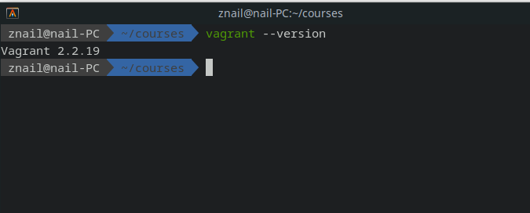
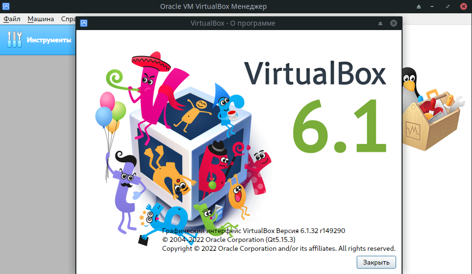
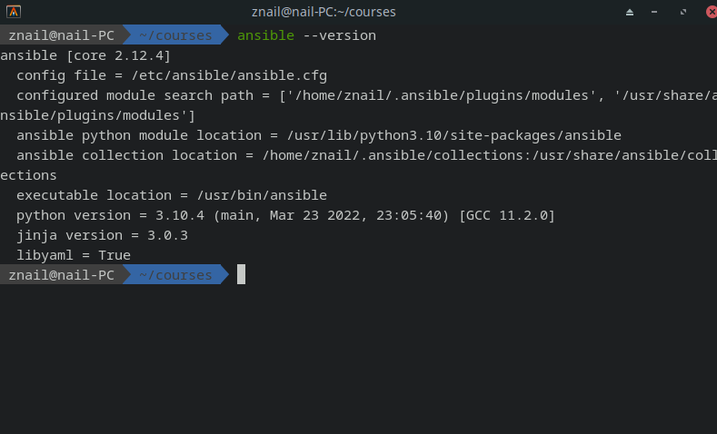

# 1.

 - Намного быстрее происходит процесс перевода программного продукта в продакшен среды.Также во много раз ускоряется процесс тестирования, исправления ошибок и масштабирования в среде разработки.

- Увеличивается стабильность среды, уменьшается вероятность возникновения ошибок из за несовпадения сред разработки, тестирования и развертывания (так называемый дрейф конфигурации).

- Увеличивается скорость и эффективность разработки, за счет того что каждый этап жизненного цикла ПО четко регламентирован и стандартизирован. Можно быстро развернуть тестовые среды  и среды CI/CD, что повышает безопасность и скорость изменения под требования рынка и пользователей продукта. 

Главным принципом IaaC является **идемпотентность**. Это свойство среды при котором повторное исполнение кода всегда выдается идентичный результат предыдущим и всем последующим исполнениям.

# 2. 

Главным отличием выделяющим Ansible от других систем является то, что он использует уже существующую среду SSH установленную в систему. Не нужно устанавливать какое то специальное окружение, используются уже существующие ключи для доступа к удаленным системам.
Преимуществами Ansible:
- скорость;
- простота;
- расширяеомсть.

На мой взгляд более надежным методом работы систем конфигураций является Pull метод, т.к. при увеличении количества обслуживаемых серверов он более стабилен и не так много потербляет ресурсов. Конфигурация для системы с большей вероятностью будет применена в нужный момент т.к. запрос идет от самой системы.

# 3.

