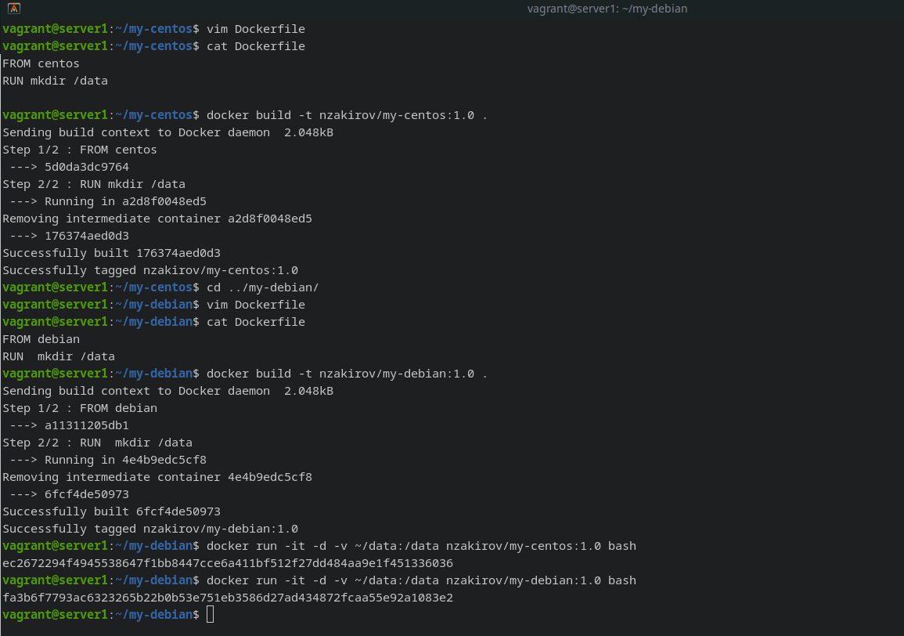
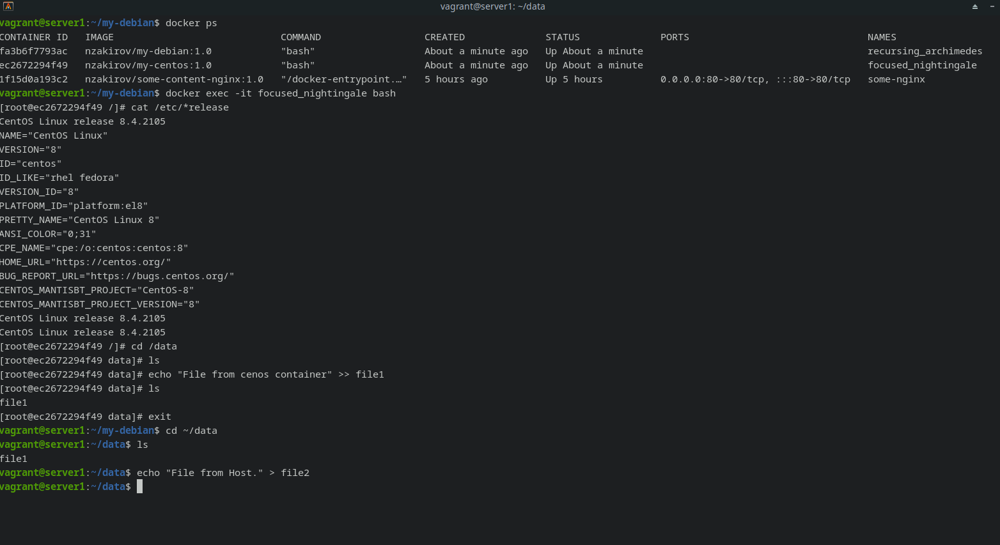
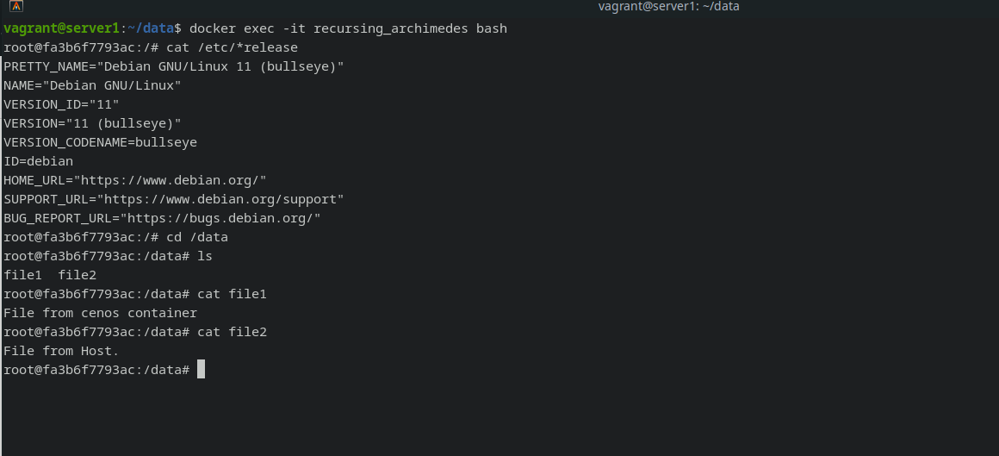

# 1.

https://hub.docker.com/r/nzakirov/some-content-nginx

# 2.

Высоконагруженное монолитное java веб-приложение
- Использование Docker контейнеров не подходит, т.к. Java-процессы, исполняемые внутри контейнеров Linux (среди них — docker, rkt, runC, lxcfs, и другие), ведут себя не так, как ожидается. 

Nodejs веб-приложение
- Возможно использовать Docker контейнеры, это позволяет сделать  проект более модульным и портативным с помощью извлечения чувствительной информации и отделив состояние  приложения от кода приложения. 

Мобильное приложение c версиями для Android и iOS
- Возможно использовать Docker контейнеры, это дает возможность разделять например различные модули по отдельным контейнерам в зависимости от моделей мобильных устройств с различным окружением.

Шина данных на базе Apache Kafka
 - Возможно использовать Docker. Настройка Apache Kafka подразумевает предварительную настойку множества инструментов которые в различных дистирбутивах настраиваются и ведут себя по разному. Создание контейнера сделает развертывание и перенос на другие системы более удобным и быстрым.

 Elasticsearch кластер для реализации логирования продуктивного веб-приложения - три ноды elasticsearch, два logstash и две ноды kibana
- Рекомендуется использовать Docker, это облегчает процесс оркестрации служб и согласование конфигураций, обновления и технического обслуживания.

Мониторинг-стек на базе Prometheus и Grafana
- Возможно использование контейнеров Docker, это убыстряет процесс развертывания и масштабирования системы мониторинга, когда например необходимо быстро подключить уже отлаженный мониторинг-стек к новым развертываемым проектам.

MongoDB, как основное хранилище данных для java-приложения
- Согласно официальной документации использовать MongoDB в Docker возможно. Но существующий community edition образ рекомендуют использвать только в среде разработки. Для продакшен среды рекомендовано использование Enterprise версии с использование определенных инструкций. 

Gitlab сервер для реализации CI/CD процессов и приватный (закрытый) Docker Registry
- Возможно использование Docker, это позволит добавлять новую функциональность быстрее и надежнее.

# 3.

# 4.

https://hub.docker.com/r/nzakirov/ansible

