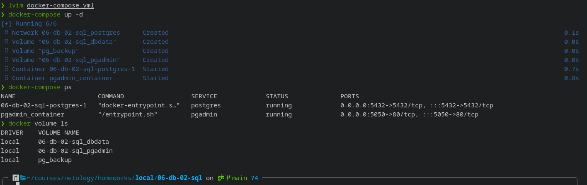

## *In process...*


# 1.

Требуемые сервисы запустим посредством docker-compose:

```yaml
version: "3.3"

volumes:
  dbdata: {}
  pgadmin: {}
  backup:
    driver: local
    name: pg_backup

networks:
  postgres:
    driver: bridge

services:
  postgres:
    image: postgres:12
    environment:
      POSTGRES_USER: "postgres"
      POSTGRES_PASSWORD: "123"
      PGDATA: "/var/lib/postgresql/data/pgdata"
    volumes:
      - "dbdata:/var/lib/postgresql/data"
      - "backup:/backup"
    ports:
      - "5432:5432"
    networks:
      - postgres

  pgadmin:
    container_name: pgadmin_container
    image: dpage/pgadmin4:6.9
    environment:
      PGADMIN_DEFAULT_EMAIL: "nzakirov@gmail.com"
      PGADMIN_DEFAULT_PASSWORD: "123"
      PGADMIN_CONFIG_SERVER_MODE: "False"
    volumes:
      - pgadmin:/var/lib/pgadmin
    ports:
      - "5050:80"
    restart: unless-stopped
    deploy:
      resources:
        limits:
          cpus: '0.5'
          memory: 1G
    networks:
      - postgres
```



# 2.

- **создайте пользователя test-admin-user и БД test_db**

```sql
CREATE USER "test-admin-user" WITH PASSWORD 'pass123';
CREATE DATABASE test_db;

\c test_db
```

- **в БД test_db создайте таблицу orders и clients**
```sql
CREATE TABLE orders (
    id serial PRIMARY KEY,
    product varchar(128),
    price numeric(10,2)
);

CREATE TABLE clients (
    id serial PRIMARY KEY,
    person varchar(64),
    country varchar(64),
    order_id integer default null,
    FOREIGN KEY (order_id) REFERENCES orders (id)
);
```
- **предоставьте привилегии на все операции пользователю test-admin-user на таблицы БД test_db**
```sql
GRANT ALL PRIVILEGES ON orders TO "test-admin-user";
GRANT ALL PRIVILEGES ON clients TO "test-admin-user";
```
- **создайте пользователя test-simple-user**
```sql
CREATE USER "test-simple-user" WITH PASSWORD '123';
```

- **предоставьте пользователю test-simple-user права на SELECT/INSERT/UPDATE/DELETE данных таблиц БД test_db**
```sql
GRANT SELECT, INSERT, UPDATE, DELETE ON orders TO "test-simple-user";
GRANT SELECT, INSERT, UPDATE, DELETE ON clients TO "test-simple-user";
```

Итоговый список БД после выполнения пунктов выше:
```
test_db=# \l
                                 List of databases
   Name    |  Owner   | Encoding |  Collate   |   Ctype    |   Access privileges   
-----------+----------+----------+------------+------------+-----------------------
 postgres  | postgres | UTF8     | en_US.utf8 | en_US.utf8 | 
 template0 | postgres | UTF8     | en_US.utf8 | en_US.utf8 | =c/postgres          +
           |          |          |            |            | postgres=CTc/postgres
 template1 | postgres | UTF8     | en_US.utf8 | en_US.utf8 | =c/postgres          +
           |          |          |            |            | postgres=CTc/postgres
 test_db   | postgres | UTF8     | en_US.utf8 | en_US.utf8 | 
(4 rows)

test_db=# 

```
Описание таблиц (describe):
```
test_db=# \d orders
                       Table "public.orders"
 Column  |          Type          | Collation | Nullable | Default 
---------+------------------------+-----------+----------+---------
 id      | integer                |           | not null |  nextval('clients_id_seq'::regclass) 
 product | character varying(128) |           |          | 
 price   | numeric(10,2)          |           |          | 
Indexes:
    "orders_pkey" PRIMARY KEY, btree (id)
Referenced by:
    TABLE "clients" CONSTRAINT "clients_order_id_fkey" FOREIGN KEY (order_id) REFERENCES orders(id)

test_db=# \d clients
                      Table "public.clients"
  Column  |         Type          | Collation | Nullable | Default 
----------+-----------------------+-----------+----------+---------
 id       | integer               |           | not null |  nextval('clients_id_seq'::regclass) 
 person   | character varying(64) |           |          | 
 country  | character varying(64) |           |          | 
 order_id | integer               |           |          | 
Indexes:
    "clients_pkey" PRIMARY KEY, btree (id)
Foreign-key constraints:
    "clients_order_id_fkey" FOREIGN KEY (order_id) REFERENCES orders(id)


```
SQL-запрос для выдачи списка пользователей с правами над таблицами test_db:
```
SELECT * FROM information_schema.table_privileges 
 WHERE table_catalog = 'test_db'
  AND table_schema  = 'public'
  AND grantee != 'postgres';

```
список пользователей с правами над таблицами test_db
```
 grantor  |     grantee      | table_catalog | table_schema | table_name | privilege_type | is_grantable | with_hierarchy 
----------+------------------+---------------+--------------+------------+----------------+--------------+----------------
 postgres | test-admin-user  | test_db       | public       | orders     | INSERT         | NO           | NO
 postgres | test-admin-user  | test_db       | public       | orders     | SELECT         | NO           | YES
 postgres | test-admin-user  | test_db       | public       | orders     | UPDATE         | NO           | NO
 postgres | test-admin-user  | test_db       | public       | orders     | DELETE         | NO           | NO
 postgres | test-admin-user  | test_db       | public       | orders     | TRUNCATE       | NO           | NO
 postgres | test-admin-user  | test_db       | public       | orders     | REFERENCES     | NO           | NO
 postgres | test-admin-user  | test_db       | public       | orders     | TRIGGER        | NO           | NO
 postgres | test-simple-user | test_db       | public       | orders     | INSERT         | NO           | NO
 postgres | test-simple-user | test_db       | public       | orders     | SELECT         | NO           | YES
 postgres | test-simple-user | test_db       | public       | orders     | UPDATE         | NO           | NO
 postgres | test-simple-user | test_db       | public       | orders     | DELETE         | NO           | NO
 postgres | test-admin-user  | test_db       | public       | clients    | INSERT         | NO           | NO
 postgres | test-admin-user  | test_db       | public       | clients    | SELECT         | NO           | YES
 postgres | test-admin-user  | test_db       | public       | clients    | UPDATE         | NO           | NO
 postgres | test-admin-user  | test_db       | public       | clients    | DELETE         | NO           | NO
 postgres | test-admin-user  | test_db       | public       | clients    | TRUNCATE       | NO           | NO
 postgres | test-admin-user  | test_db       | public       | clients    | REFERENCES     | NO           | NO
 postgres | test-admin-user  | test_db       | public       | clients    | TRIGGER        | NO           | NO
 postgres | test-simple-user | test_db       | public       | clients    | INSERT         | NO           | NO
 postgres | test-simple-user | test_db       | public       | clients    | SELECT         | NO           | YES
 postgres | test-simple-user | test_db       | public       | clients    | UPDATE         | NO           | NO
 postgres | test-simple-user | test_db       | public       | clients    | DELETE         | NO           | NO
(22 rows)
```

# 3.

```sql
INSERT INTO orders (product, price) VALUES
('Шоколад', 10),
('Принтер', 3000),
('Книга', 500),
('Монитор', 7000),
('Гитара', 4000);
```

```sql
INSERT INTO clients (person, country) VALUES
('Иванов Иван Иванович', 'USA'),
('Петров Петр Петрович', 'Canada'),
('Иоганн Себастьян Бах', 'Japan'),
('Ронни Джеймс Дио', 'Russia'),
('Ritchie Blackmore', 'Russia');
```

```
test_db=# SELECT COUNT (*) FROM orders;
 count 
-------
     5
(1 row)

test_db=# SELECT COUNT (*) FROM clients;
 count 
-------
     5
(1 row)

```

# 4.

```sql
UPDATE clients SET order_id =
    (SELECT id FROM orders WHERE product = 'Книга')
WHERE id = 
    (SELECT id FROM clients WHERE person = 'Иванов Иван Иванович');


UPDATE clients SET order_id =
    (SELECT id FROM orders WHERE product = 'Монитор')
WHERE id = 
    (SELECT id FROM clients WHERE person = 'Петров Петр Петрович');


UPDATE clients SET order_id =
    (SELECT id FROM orders WHERE product = 'Гитара')
WHERE id = 
    (SELECT id FROM clients WHERE person = 'Иоганн Себастьян Бах');
```


Все пользователи, которые совершили заказ:

```sql
test_db=# SELECT person FROM clients WHERE order_id IS NOT NULL;
        person        
----------------------
 Иванов Иван Иванович
 Петров Петр Петрович
 Иоганн Себастьян Бах
(3 rows)

```

## *To be continued. In process...*
