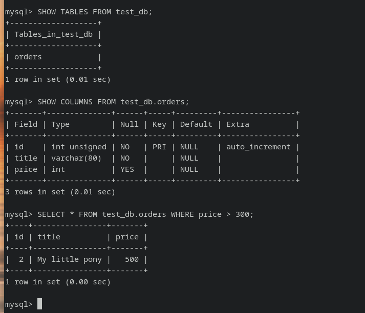

# 1.




# 2.

```sql
CREATE USER IF NOT EXISTS 'test'@'%' IDENTIFIED WITH mysql_native_password BY 'test-pass'
WITH MAX_CONNECTIONS_PER_HOUR 100
PASSWORD EXPIRE INTERVAL 180 DAY
FAILED_LOGIN_ATTEMPTS 3
ATTRIBUTE '{"Lastname":"Pretty", "Name":"James"}';
```
```sql
GRANT SELECT ON test_db.* TO 'test'@'%';
```

```sql
mysql> SELECT * FROM INFORMATION_SCHEMA.USER_ATTRIBUTES WHERE USER = 'test';
+------+------+-----------------------------------------+
| USER | HOST | ATTRIBUTE                               |
+------+------+-----------------------------------------+
| test | %    | {"Name": "James", "Lastname": "Pretty"} |
+------+------+-----------------------------------------+
1 row in set (0.00 sec)
```

```sql
mysql> SHOW GRANTS FOR 'test'@'%';
+-------------------------------------------+
| Grants for test@%                         |
+-------------------------------------------+
| GRANT USAGE ON *.* TO `test`@`%`          |
| GRANT SELECT ON `test_db`.* TO `test`@`%` |
+-------------------------------------------+
2 rows in set (0.00 sec)
```

# 3.


