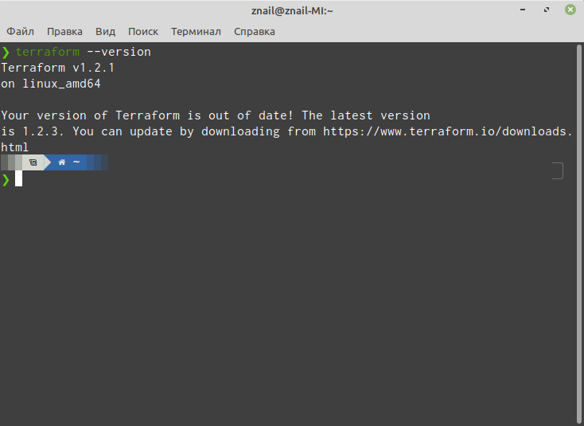
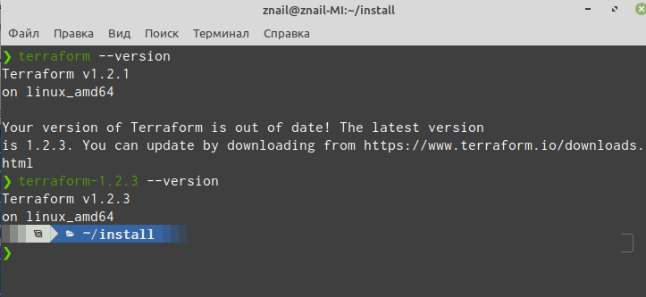

# 1.

- *Какой тип инфраструктуры будем использовать для этого проекта: изменяемый или не изменяемый?*

На начальных этапах будем сочетать изменяемый и незименяемый, дабы плавно перейти на новую инфраструктуру и при частых релизах на начальном этапе. В дальнейшем будем переходить на неизменяемый тип инфраструктуры. Это даст возможность проще управлять в дальнейшем всей инфраструктурой.

- *Будет ли центральный сервер для управления инфраструктурой?*

Центрального сервера  не будет, т.к. за основу будет взять Terraform,  которому не требуется центральный сервер.

- *Будут ли агенты на серверах?*

Нет. Т.к. будут использоваться решения без агентов.

- *Будут ли использованы средства для управления конфигурацией или инициализации ресурсов?*

Да, будут использованы Terraform и существующий Ansible, c переходом на  Terraform.

# 2.



# 3.

Задачу можно решить путем скачивания бинарника  новой версии и установки под другим именем по пути PATH. Это даст возможность использовать одновременно две версии:

```
❯ wget https://releases.hashicorp.com/terraform/1.2.3/terraform_1.2.3_linux_amd64.zip

❯ unzip terraform_1.2.3_linux_amd64.zip
Archive:  terraform_1.2.3_linux_amd64.zip
  inflating: terraform

❯ cp terraform ~/bin/terraform-1.2.3

```




