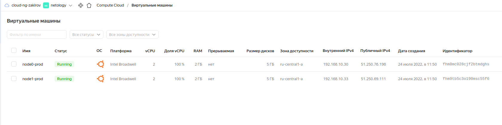

# Домашнее задание к занятию "7.3. Основы и принцип работы Терраформ"

## Задача 1. Создадим бэкэнд в S3 (необязательно, но крайне желательно).

<details><summary></summary>

> Если в рамках предыдущего задания у вас уже есть аккаунт AWS, то давайте продолжим знакомство со взаимодействием терраформа и aws. 
> 
> 1. Создайте s3 бакет, iam роль и пользователя от которого будет работать терраформ. Можно создать отдельного пользователя, а можно использовать созданного в рамках предыдущего задания, просто добавьте ему необходимы права, как описано [здесь](https://www.terraform.io/docs/backends/types/s3.html).
> 1. Зарегистрируйте бэкэнд в терраформ проекте как описано по ссылке выше. 

</details>


Создаем s3 бакет при помощи утилиты ```s3cmd```:

```
❯ s3cmd mb s3://terraform-state-nz
Bucket 's3://terraform-state-nz/' created

❯ s3cmd ls
2022-07-23 17:16  s3://terraform-state-nz
```

Объявляем созданный бакет в terrafrom:

```terraform
 backend "s3" {
    endpoint = "storage.yandexcloud.net"
    bucket = "terraform-state-nz"
    region = "ru-central1"
    key = "terraform.tfstate"
    skip_region_validation = true
    skip_credentials_validation = true
  }
```

## Задача 2. Инициализируем проект и создаем воркспейсы. 

<details> 
<summary>1.</summary>

> Выполните `terraform init`:
>   * если был создан бэкэнд в S3, то терраформ создат файл стейтов в S3 и запись в таблице dynamodb.
>   * иначе будет создан локальный файл со стейтами.  
</details>

```
❯ terraform init \
      -backend-config "access_key=$TF_VAR_yandex_access_key" \
      -backend-config "secret_key=$TF_VAR_yandex_secret_key"

Initializing the backend...

Successfully configured the backend "s3"! Terraform will automatically
use this backend unless the backend configuration changes.

Initializing provider plugins...
- Finding latest version of yandex-cloud/yandex...
- Installing yandex-cloud/yandex v0.76.0...
- Installed yandex-cloud/yandex v0.76.0 (unauthenticated)

Terraform has created a lock file .terraform.lock.hcl to record the provider
selections it made above. Include this file in your version control repository
so that Terraform can guarantee to make the same selections by default when
you run "terraform init" in the future.

Terraform has been successfully initialized!

You may now begin working with Terraform. Try running "terraform plan" to see
any changes that are required for your infrastructure. All Terraform commands
should now work.

If you ever set or change modules or backend configuration for Terraform,
rerun this command to reinitialize your working directory. If you forget, other
commands will detect it and remind you to do so if necessary.
❯ terraform workspace new stage
Created and switched to workspace "stage"!

You're now on a new, empty workspace. Workspaces isolate their state,
so if you run "terraform plan" Terraform will not see any existing state
for this configuration.
```
<details><summary>2.</summary>

> Создайте два воркспейса `stage` и `prod`.
</details>

```
❯ terraform workspace list
  default
```

```
❯ terraform workspace new stage 
Created and switched to workspace "stage"!

You're now on a new, empty workspace. Workspaces isolate their state,
so if you run "terraform plan" Terraform will not see any existing state
for this configuration.
```

```
❯ terraform workspace new prod
Created and switched to workspace "prod"!

You're now on a new, empty workspace. Workspaces isolate their state,
so if you run "terraform plan" Terraform will not see any existing state
for this configuration.
```

```
❯ terraform workspace list
  default
* prod
  stage
```
<details><summary>3.</summary>

> В уже созданный `aws_instance` добавьте зависимость типа инстанса от вокспейса, что бы в разных ворскспейсах использовались разные `instance_type`.
</details>

<details><summary>4.</summary>

> Добавим `count`. Для `stage` должен создаться один экземпляр `ec2`, а для `prod` два. 
</details>

Создадим две подсети:

```terraform
resource "yandex_vpc_subnet" "subnet_terraform" {
  name           = terraform.workspace == "prod" ? "subnet-prod" : "subnet-stage"
  zone           = "ru-central1-a"
  network_id     = "${yandex_vpc_network.network_terraform.id}"
  v4_cidr_blocks = terraform.workspace == "prod" ? ["192.168.10.0/24"] : ["192.168.11.0/24"]
}
```

Объявляем инстанс:

```terraform
data "yandex_compute_image" "ubuntu_image" {
    family = "ubuntu-2004-lts"
}

resource "yandex_compute_instance" "node" {
    name                      = terraform.workspace == "prod" ? "node${count.index}-prod" : "node${count.index}-stage"
    zone                      = "ru-central1-a"
    hostname                  = terraform.workspace == "prod" ? "node${count.index}-prod.netology.yc" : "node${count.index}-stage.netology.yc"
    allow_stopping_for_update = true
    count = terraform.workspace == "prod" ? 2 : 1

    resources {
      cores  = terraform.workspace == "prod" ? 2 : 1
      memory = terraform.workspace == "prod" ? 2 : 1
    }


  
  boot_disk {
    initialize_params {
        image_id = data.yandex_compute_image.ubuntu_image.id
        # type        = "network-nvme"
        # size        = "10"
    }
  }

  network_interface {
    subnet_id = yandex_vpc_subnet.subnet_terraform.id
    nat = true
  }

  metadata = {
    user-data = "${file("./meta.yml")}"
    ssh-authorized-keys = "test1:${file("~/.ssh/id_rsa.pub")}"

  }
}
```


<details><summary>5.</summary>

> Создайте рядом еще один `aws_instance`, но теперь определите их количество при помощи `for_each`, а не `count`.
</details>

<details><summary>6.</summary>

> Что бы при изменении типа инстанса не возникло ситуации, когда не будет ни одного инстанса добавьте параметр жизненного цикла `create_before_destroy = true` в один из рессурсов `aws_instance`.
</details>

```terraform
data "yandex_compute_image" "ubuntu_image" {
    family = "ubuntu-2004-lts"
}

resource "yandex_compute_instance" "node-foreach" {
  for_each = toset(terraform.workspace == "prod" ? ["node01","node02"] : ["node01"])
#  name                      = "${each.value}-${terraform.workspace == "prod" ? "prod" : "stage"}"
  zone                      = "ru-central1-a"
#  hostname                  = "${each.value}-${terraform.workspace == "prod" ? "prod" : "-stage"}.netology.yc"
  allow_stopping_for_update = true

  lifecycle {
    create_before_destroy = true
  }

  resources {
    cores  = 2
    memory = 2
  }
  
  boot_disk {
    initialize_params {
        image_id = data.yandex_compute_image.ubuntu_image.id
        # type        = "network-nvme"
        # size        = "10"
    }
  }

  network_interface {
    subnet_id = yandex_vpc_subnet.subnet_terraform.id
    nat = true
  }

  metadata = {
    user-data = "${file("./meta.yml")}"
    ssh-authorized-keys = "test1:${file("~/.ssh/id_rsa.pub")}"

  }
}
```

```
❯ terraform plan
data.yandex_compute_image.ubuntu_image: Reading...
data.yandex_compute_image.ubuntu_image: Read complete after 0s [id=fd826dalmbcl81eo5nig]

Terraform used the selected providers to generate the following execution plan. Resource actions are indicated with the
following symbols:
  + create

Terraform will perform the following actions:

  # yandex_compute_instance.node-foreach["node01"] will be created
  + resource "yandex_compute_instance" "node-foreach" {
      + allow_stopping_for_update = true
      + created_at                = (known after apply)
      + folder_id                 = (known after apply)
      + fqdn                      = (known after apply)
      + hostname                  = "node01-prod.netology.yc"
      + id                        = (known after apply)
      + metadata                  = {
          + "ssh-authorized-keys" = <<-EOT
                test1:ssh-rsa AAAAB3NzaC1yc2EAAAADAQABAAABgQCwAHu6HFygFru++SpE/FbTNa..................................................hA9QmaAZ+OhH66DGwBTKmW0vzRLpMT6Ad0ru5YZk/XkKXqUmCqhtw08jSirzywHwHtmvx3ICush6Uo7XkecmcBwntozDPwQzyFTZdGCicrLZa1exMFkG4UQ4zDW2TIWWDI/UlBsSgrs0mcA+QrPHeV6cUG+1cxwFHWU5tW++UmA5YDUs2UhWdF+MYzkyZeRZg5zlYGLubGE6t1OkCMdaRsypIKMVCrW+gMxPlBzE+rgR8xvqZ3ZsWGxx7DZL4N46asKuT1oTTg9/9b3BRfeVdCahUllQbgbGumyPPEwAG5x3e2xDefM8= znail@nail-PC
            EOT
          + "user-data"           = <<-EOT
                #cloud-config
                users:
                  - name: test
                    groups: sudo
                    shell: /bin/bash
                    sudo: ['ALL=(ALL) NOPASSWD:ALL']
            EOT
        }
      + name                      = "node01-prod"
      + network_acceleration_type = "standard"
      + platform_id               = "standard-v1"
      + service_account_id        = (known after apply)
      + status                    = (known after apply)
      + zone                      = "ru-central1-a"

      + boot_disk {
          + auto_delete = true
          + device_name = (known after apply)
          + disk_id     = (known after apply)
          + mode        = (known after apply)

          + initialize_params {
              + block_size  = (known after apply)
              + description = (known after apply)
              + image_id    = "fd826dalmbcl81eo5nig"
              + name        = (known after apply)
              + size        = (known after apply)
              + snapshot_id = (known after apply)
              + type        = "network-hdd"
            }
        }

      + network_interface {
          + index              = (known after apply)
          + ip_address         = (known after apply)
          + ipv4               = true
          + ipv6               = (known after apply)
          + ipv6_address       = (known after apply)
          + mac_address        = (known after apply)
          + nat                = true
          + nat_ip_address     = (known after apply)
          + nat_ip_version     = (known after apply)
          + security_group_ids = (known after apply)
          + subnet_id          = (known after apply)
        }

      + placement_policy {
          + host_affinity_rules = (known after apply)
          + placement_group_id  = (known after apply)
        }

      + resources {
          + core_fraction = 100
          + cores         = 2
          + memory        = 2
        }

      + scheduling_policy {
          + preemptible = (known after apply)
        }
    }

  # yandex_compute_instance.node-foreach["node02"] will be created
  + resource "yandex_compute_instance" "node-foreach" {
      + allow_stopping_for_update = true
      + created_at                = (known after apply)
      + folder_id                 = (known after apply)
      + fqdn                      = (known after apply)
      + hostname                  = "node02-prod.netology.yc"
      + id                        = (known after apply)
      + metadata                  = {
          + "ssh-authorized-keys" = <<-EOT
                test1:ssh-rsa AAAAB3NzaC1yc2E........................................NzqOp0lL5BGI821IWMlYOKL8OPGr9hA9QmaAZ+OhH66DGwBTKmW0vzRLpMT6Ad0ru5YZk/XkKXqUmCqhtw08jSirzywHwHtmvx3ICush6Uo7XkecmcBwntozDPwQzyFTZdGCicrLZa1exMFkG4UQ4zDW2TIWWDI/UlBsSgrs0mcA+QrPHeV6cUG+1cxwFHWU5tW++UmA5YDUs2UhWdF+MYzkyZeRZg5zlYGLubGE6t1OkCMdaRsypIKMVCrW+gMxPlBzE+rgR8xvqZ3ZsWGxx7DZL4N46asKuT1oTTg9/9b3BRfeVdCahUllQbgbGumyPPEwAG5x3e2xDefM8= znail@nail-PC
            EOT
          + "user-data"           = <<-EOT
                #cloud-config
                users:
                  - name: test
                    groups: sudo
                    shell: /bin/bash
                    sudo: ['ALL=(ALL) NOPASSWD:ALL']
            EOT
        }
      + name                      = "node02-prod"
      + network_acceleration_type = "standard"
      + platform_id               = "standard-v1"
      + service_account_id        = (known after apply)
      + status                    = (known after apply)
      + zone                      = "ru-central1-a"

      + boot_disk {
          + auto_delete = true
          + device_name = (known after apply)
          + disk_id     = (known after apply)
          + mode        = (known after apply)

          + initialize_params {
              + block_size  = (known after apply)
              + description = (known after apply)
              + image_id    = "fd826dalmbcl81eo5nig"
              + name        = (known after apply)
              + size        = (known after apply)
              + snapshot_id = (known after apply)
              + type        = "network-hdd"
            }
        }

      + network_interface {
          + index              = (known after apply)
          + ip_address         = (known after apply)
          + ipv4               = true
          + ipv6               = (known after apply)
          + ipv6_address       = (known after apply)
          + mac_address        = (known after apply)
          + nat                = true
          + nat_ip_address     = (known after apply)
          + nat_ip_version     = (known after apply)
          + security_group_ids = (known after apply)
          + subnet_id          = (known after apply)
        }

      + placement_policy {
          + host_affinity_rules = (known after apply)
          + placement_group_id  = (known after apply)
        }

      + resources {
          + core_fraction = 100
          + cores         = 2
          + memory        = 2
        }

      + scheduling_policy {
          + preemptible = (known after apply)
        }
    }

  # yandex_vpc_network.network_terraform will be created
  + resource "yandex_vpc_network" "network_terraform" {
      + created_at                = (known after apply)
      + default_security_group_id = (known after apply)
      + folder_id                 = (known after apply)
      + id                        = (known after apply)
      + labels                    = (known after apply)
      + name                      = "net_terraform"
      + subnet_ids                = (known after apply)
    }

  # yandex_vpc_subnet.subnet_terraform will be created
  + resource "yandex_vpc_subnet" "subnet_terraform" {
      + created_at     = (known after apply)
      + folder_id      = (known after apply)
      + id             = (known after apply)
      + labels         = (known after apply)
      + name           = "subnet-prod"
      + network_id     = (known after apply)
      + v4_cidr_blocks = [
          + "192.168.10.0/24",
        ]
      + v6_cidr_blocks = (known after apply)
      + zone           = "ru-central1-a"
    }

Plan: 4 to add, 0 to change, 0 to destroy.
```


<details><summary>7.</summary>

> При желании поэкспериментируйте с другими параметрами и рессурсами.
>
> В виде результата работы пришлите:
> * Вывод команды `terraform workspace list`.
> * Вывод команды `terraform plan` для воркспейса `prod`.  
</details>

