# Дипломный практикум в YandexCloud

### **Преподаватель:** Булат Замилов, Олег Букатчук, Руслан Жданов

## Задание

  * [Цели:](#цели)
  * [Этапы выполнения:](#этапы-выполнения)
      * [Регистрация доменного имени](#регистрация-доменного-имени)
      * [Создание инфраструктуры](#создание-инфраструктуры)
          * [Установка Nginx и LetsEncrypt](#установка-nginx)
          * [Установка кластера MySQL](#установка-mysql)
          * [Установка WordPress](#установка-wordpress)
          * [Установка Gitlab CE, Gitlab Runner и настройка CI/CD](#установка-gitlab)
          * [Установка Prometheus, Alert Manager, Node Exporter и Grafana](#установка-prometheus)
  * [Что необходимо для сдачи задания?](#что-необходимо-для-сдачи-задания)
  * [Как правильно задавать вопросы дипломному руководителю?](#как-правильно-задавать-вопросы-дипломному-руководителю)

<details><summary></summary>

---
>## Цели:

>1. Зарегистрировать доменное имя (любое на ваш выбор в любой доменной зоне).
>3. Настроить внешний Reverse Proxy на основе Nginx и LetsEncrypt.
>2. Подготовить инфраструктуру с помощью Terraform на базе облачного провайдера YandexCloud.
>4. Настроить кластер MySQL.
>5. Установить WordPress.
>6. Развернуть Gitlab CE и Gitlab Runner.
>7. Настроить CI/CD для автоматического развёртывания приложения.
>8. Настроить мониторинг инфраструктуры с помощью стека: Prometheus, Alert Manager и Grafana.

---
>## Этапы выполнения:
>
>### Регистрация доменного имени
>
>Подойдет любое доменное имя на ваш выбор в любой доменной зоне.
>
>ПРИМЕЧАНИЕ: Далее в качестве примера используется домен `you.domain` замените его вашим доменом.
>
>Рекомендуемые регистраторы:
>  - [nic.ru](https://nic.ru)
>  - [reg.ru](https://reg.ru)
>
>Цель:
>
>1. Получить возможность выписывать [TLS сертификаты](https://letsencrypt.org) для веб-сервера.
>
>Ожидаемые результаты:
>
>1. У вас есть доступ к личному кабинету на сайте регистратора.
>2. Вы зарезистрировали домен и можете им управлять (редактировать dns записи в рамках этого домена).
>
>
>### Создание инфраструктуры
>
>Для начала необходимо подготовить инфраструктуру в YC при помощи [Terraform](https://www.terraform.io/).
>
>Особенности выполнения:
>
>- Бюджет купона ограничен, что следует иметь в виду при проектировании инфраструктуры и использовании ресурсов;
>- Следует использовать последнюю стабильную версию [Terraform](https://www.terraform.io/).
>
>Предварительная подготовка:
>
>1. Создайте сервисный аккаунт, который будет в дальнейшем использоваться Terraform для работы с инфраструктурой с необходимыми и достаточными правами. Не стоит использовать права суперпользователя
>2. Подготовьте [backend](https://www.terraform.io/docs/language/settings/backends/index.html) для Terraform:
>   а. Рекомендуемый вариант: [Terraform Cloud](https://app.terraform.io/)  
>   б. Альтернативный вариант: S3 bucket в созданном YC аккаунте.
>3. Настройте [workspaces](https://www.terraform.io/docs/language/state/workspaces.html)
>   а. Рекомендуемый вариант: создайте два workspace: *stage* и *prod*. В случае выбора этого варианта все последующие шаги должны учитывать факт существования нескольких workspace.  
>   б. Альтернативный вариант: используйте один workspace, назвав его *stage*. Пожалуйста, не используйте workspace, создаваемый Terraform-ом по-умолчанию (*default*).
>4. Создайте VPC с подсетями в разных зонах доступности.
>5. Убедитесь, что теперь вы можете выполнить команды `terraform destroy` и `terraform apply` без дополнительных ручных действий.
>6. В случае использования [Terraform Cloud](https://app.terraform.io/) в качестве [backend](https://www.terraform.io/docs/language/settings/backends/index.html) убедитесь, что применение изменений успешно проходит, используя web-интерфейс Terraform cloud.
>
>Цель:
>
>1. Повсеместно применять IaaC подход при организации (эксплуатации) инфраструктуры.
>2. Иметь возможность быстро создавать (а также удалять) виртуальные машины и сети. С целью экономии денег на вашем аккаунте в YandexCloud.
>
>Ожидаемые результаты:
>
>1. Terraform сконфигурирован и создание инфраструктуры посредством Terraform возможно без дополнительных ручных действий.
>2. Полученная конфигурация инфраструктуры является предварительной, поэтому в ходе дальнейшего выполнения задания возможны изменения.
>
>---
>### Установка Nginx и LetsEncrypt
>
>Необходимо разработать Ansible роль для установки Nginx и LetsEncrypt.
>
>**Для получения LetsEncrypt сертификатов во время тестов своего кода пользуйтесь [тестовыми сертификатами](https://letsencrypt.org/docs/staging-environment/), так как количество запросов к боевым серверам LetsEncrypt [лимитировано](https://letsencrypt.org/docs/rate-limits/).**
>
>Рекомендации:
>  - Имя сервера: `you.domain`
>  - Характеристики: 2vCPU, 2 RAM, External address (Public) и Internal address.
>
>Цель:
>
>1. Создать reverse proxy с поддержкой TLS для обеспечения безопасного доступа к веб-сервисам по HTTPS.
>
>Ожидаемые результаты:
>
>1. В вашей доменной зоне настроены все A-записи на внешний адрес этого сервера:
>    - `https://www.you.domain` (WordPress)
>    - `https://gitlab.you.domain` (Gitlab)
>    - `https://grafana.you.domain` (Grafana)
>    - `https://prometheus.you.domain` (Prometheus)
>    - `https://alertmanager.you.domain` (Alert Manager)
>2. Настроены все upstream для выше указанных URL, куда они сейчас ведут на этом шаге не важно, позже вы их отредактируете и укажите верные значения.
>2. В браузере можно открыть любой из этих URL и увидеть ответ сервера (502 Bad Gateway). На текущем этапе выполнение задания это нормально!
>
>___
>### Установка кластера MySQL


>Необходимо разработать Ansible роль для установки кластера MySQL.
>
>Рекомендации:
>  - Имена серверов: `db01.you.domain` и `db02.you.domain`
>  - Характеристики: 4vCPU, 4 RAM, Internal address.
>
>Цель:
>
>1. Получить отказоустойчивый кластер баз данных MySQL.
>
>Ожидаемые результаты:
>
>1. MySQL работает в режиме репликации Master/Slave.
>2. В кластере автоматически создаётся база данных c именем `wordpress`.
>3. В кластере автоматически создаётся пользователь `wordpress` с полными правами на базу `wordpress` и паролем `wordpress`.
>
>**Вы должны понимать, что в рамках обучения это допустимые значения, но в боевой среде использование подобных значений не приемлимо! Считается хорошей практикой использовать логины и пароли повышенного уровня сложности. В которых будут содержаться буквы верхнего и нижнего регистров, цифры, а также специальные символы!**
>
>___
>### Установка WordPress
>
>Необходимо разработать Ansible роль для установки WordPress.
>
>Рекомендации:
>  - Имя сервера: `app.you.domain`
>  - Характеристики: 4vCPU, 4 RAM, Internal address.
>
>Цель:
>
>1. Установить [WordPress](https://wordpress.org/download/). Это система управления содержимым сайта ([CMS](https://ru.wikipedia.org/wiki/Система_управления_содержимым)) с открытым исходным кодом.
>
>
>По данным W3techs, WordPress используют 64,7% всех веб-сайтов, которые сделаны на CMS. Это 41,1% всех существующих в мире сайтов. Эту платформу для своих блогов используют The New York Times и Forbes. Такую популярность WordPress получил за удобство интерфейса и большие возможности.
>
>Ожидаемые результаты:
>
>1. Виртуальная машина на которой установлен WordPress и Nginx/Apache (на ваше усмотрение).
>2. В вашей доменной зоне настроена A-запись на внешний адрес reverse proxy:
>    - `https://www.you.domain` (WordPress)
>3. На сервере `you.domain` отредактирован upstream для выше указанного URL и он смотрит на виртуальную машину на которой установлен WordPress.
>4. В браузере можно открыть URL `https://www.you.domain` и увидеть главную страницу WordPress.
>---
>### Установка Gitlab CE и Gitlab Runner
>
>Необходимо настроить CI/CD систему для автоматического развертывания приложения при изменении кода.
>
>Рекомендации:
>  - Имена серверов: `gitlab.you.domain` и `runner.you.domain`
>  - Характеристики: 4vCPU, 4 RAM, Internal address.
>
>Цель:
>1. Построить pipeline доставки кода в среду эксплуатации, то есть настроить автоматический деплой на сервер `app.you.domain` при коммите в репозиторий с WordPress.
>
>Подробнее об [Gitlab CI](https://about.gitlab.com/stages-devops-lifecycle/continuous-integration/)
>
>Ожидаемый результат:
>
>1. Интерфейс Gitlab доступен по https.
>2. В вашей доменной зоне настроена A-запись на внешний адрес reverse proxy:
>    - `https://gitlab.you.domain` (Gitlab)
>3. На сервере `you.domain` отредактирован upstream для выше указанного URL и он смотрит на виртуальную машину на которой установлен Gitlab.
>3. При любом коммите в репозиторий с WordPress и создании тега (например, v1.0.0) происходит деплой на виртуальную машину.
>
>___
>### Установка Prometheus, Alert Manager, Node Exporter и Grafana
>
>Необходимо разработать Ansible роль для установки Prometheus, Alert Manager и Grafana.
>
>Рекомендации:
>  - Имя сервера: `monitoring.you.domain`
>  - Характеристики: 4vCPU, 4 RAM, Internal address.
>
>Цель:
>
>1. Получение метрик со всей инфраструктуры.
>
>Ожидаемые результаты:
>
>1. Интерфейсы Prometheus, Alert Manager и Grafana доступены по https.
>2. В вашей доменной зоне настроены A-записи на внешний адрес reverse proxy:
>  - `https://grafana.you.domain` (Grafana)
>  - `https://prometheus.you.domain` (Prometheus)
>  - `https://alertmanager.you.domain` (Alert Manager)
>3. На сервере `you.domain` отредактированы upstreams для выше указанных URL и они смотрят на виртуальную машину на которой установлены Prometheus, Alert Manager и Grafana.
>4. На всех серверах установлен Node Exporter и его метрики доступны Prometheus.
>5. У Alert Manager есть необходимый [набор правил](https://awesome-prometheus-alerts.grep.to/rules.html) для создания алертов.
>2. В Grafana есть дашборд отображающий метрики из Node Exporter по всем серверам.
>3. В Grafana есть дашборд отображающий метрики из MySQL (*).
>4. В Grafana есть дашборд отображающий метрики из WordPress (*).
>
>*Примечание: дашборды со звёздочкой являются опциональными заданиями повышенной сложности их выполнение желательно, но не обязательно.*
>
>---
>## Что необходимо для сдачи задания?
>
>1. Репозиторий со всеми Terraform манифестами и готовность продемонстрировать создание всех ресурсов с нуля.
>2. Репозиторий со всеми Ansible ролями и готовность продемонстрировать установку всех сервисов с нуля.
>3. Скриншоты веб-интерфейсов всех сервисов работающих по HTTPS на вашем доменном имени.
>  - `https://www.you.domain` (WordPress)
>  - `https://gitlab.you.domain` (Gitlab)
>  - `https://grafana.you.domain` (Grafana)
>  - `https://prometheus.you.domain` (Prometheus)
>  - `https://alertmanager.you.domain` (Alert Manager)
>4. Все репозитории рекомендуется хранить на одном из ресурсов ([github.com](https://github.com) или [gitlab.com](https://gitlab.com)).
>
>---
>## Как правильно задавать вопросы дипломному руководителю?
>
>**Что поможет решить большинство частых проблем:**
>
>1. Попробовать найти ответ сначала самостоятельно в интернете или в
>  материалах курса и ДЗ и только после этого спрашивать у дипломного
>  руководителя. Навык поиска ответов пригодится вам в профессиональной
>  деятельности.
>2. Если вопросов больше одного, то присылайте их в виде нумерованного
>  списка. Так дипломному руководителю будет проще отвечать на каждый из
>  них.
>3. При необходимости прикрепите к вопросу скриншоты и стрелочкой
>  покажите, где не получается.
>
>**Что может стать источником проблем:**
>
>1. Вопросы вида «Ничего не работает. Не запускается. Всё сломалось». Дипломный руководитель не сможет ответить на такой вопрос без дополнительных уточнений. Цените своё время и время других.
>2. Откладывание выполнения курсового проекта на последний момент.
>3. Ожидание моментального ответа на свой вопрос. Дипломные руководители работающие разработчики, которые занимаются, кроме преподавания, своими проектами. Их время ограничено, поэтому постарайтесь задавать правильные вопросы, чтобы получать быстрые ответы :)
>
</details>


## Отчет

Все действия по разворачиванию инфраструктуры, включая: 
- экспорт секретов;
- подключение VPN;
- инициализации S3 бакета;
- выбора в качество локальных DNS сереверов - серверов YandexCloud;
- непосредственно развертывания самой инфраструктуры, путем вызова terraform и ansible;
- тестирования доступности разворачиваемых инстансов
- вывода списка инстансов и их состояния
реализованы при попомщи bash скрипта [init.sh](./src/init.sh)

Вся инфраструктура разворачивается с нуля путем запуска скрипта, предварительно необходимо при этом иметь зарегистрированный сервисный ааккаунт в YandexCloud.

### Регистрация доменного имени

Для выполнения дипломного практикума на **RU-CENTER** был зарегистрирован домен второго уровня **nzakirov.ru** Домен был делегирован, в качестве NS серверов указаны DNS YandexCloud. 

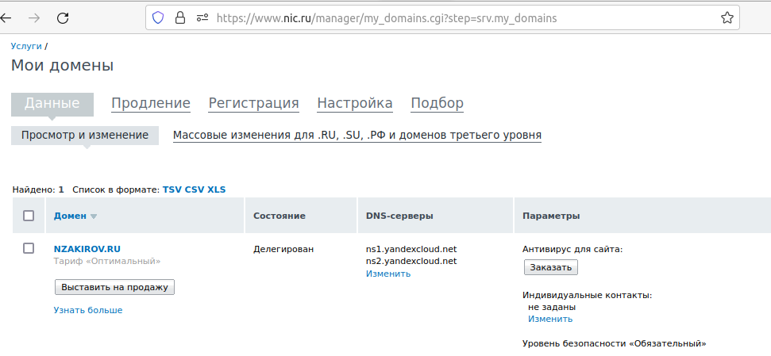


### Создание инфраструктуры

Имеем сервисный аккаунт nzakirovs в YandexCloud, при этом секретные файлы полученные от YandexCloud расположены по путям (указанным в экспорте) на локальном хосте. 

Для хранения состояния инфраструктуры используем [S3](./src/terraform/s3/) бакет, который разворачиваем при помощи Terraform. Для этого объявляем провайдера и переменные, которые реализованы во всем проекте через механизм экспорта путем добавления служебного префикса ```TF_VAR_```

Экспортируем секреты:

```bash
# Export secret variables
echo "# ====== Exporting YC credentials ... ==== #"
export TF_VAR_YC_SERVICE_ACCOUNT_KEY_FILE=~/.config/yandex-cloud/sa_nzakirovs/key.json
export TF_VAR_YC_STORAGE_ACCESS_KEY=`head -1 ~/.config/yandex-cloud/sa_nzakirovs/access.key`
export TF_VAR_YC_STORAGE_SECRET_KEY="`head -1 ~/.config/yandex-cloud/sa_nzakirovs/secret.key`"
export TF_VAR_YC_CLOUD_ID="`yc config get cloud-id`"
export TF_VAR_YC_FOLDER_ID="`yc config get folder-id`"
export TF_VAR_YC_TOKEN="`yc iam create-token`"
```

Инициализируем S3 бакет:

```bash
# S3 init
echo "# ===== S3 initialisation ... ============ #"
cd terraform/s3/ || return
terraform init && terraform plan &&  terraform apply -auto-approve
```
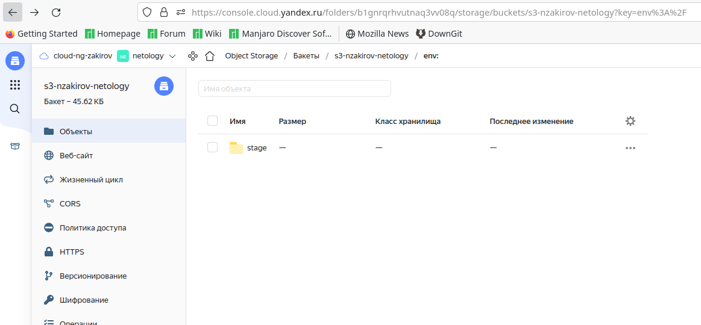

Разворачиваем инфраструктуру c workspace [stage](./src/terraform/stage/) при помощи Terraform:

```
echo "#===== Deployment infrastructure ... ==== #"
cd ../stage || return
terraform init -reconfigure \
      -backend-config "access_key=$TF_VAR_YC_STORAGE_ACCESS_KEY" \
      -backend-config "secret_key=$TF_VAR_YC_STORAGE_SECRET_KEY"
terraform workspace new stage
terraform init && terraform plan && terraform apply -auto-approve
```
Управление зоной DNS проекта осуществляется при помощи  YandexCloud DNS. Зона полностью автоматически управляется с помощью [terraform кода](./src/terraform/stage/yc_dns.tf). Создаются необходимые для проекта A записи внутри домена **nzakirov.ru**, указывающие на внешний ip виртуальной машины выполняющей роль proxy:

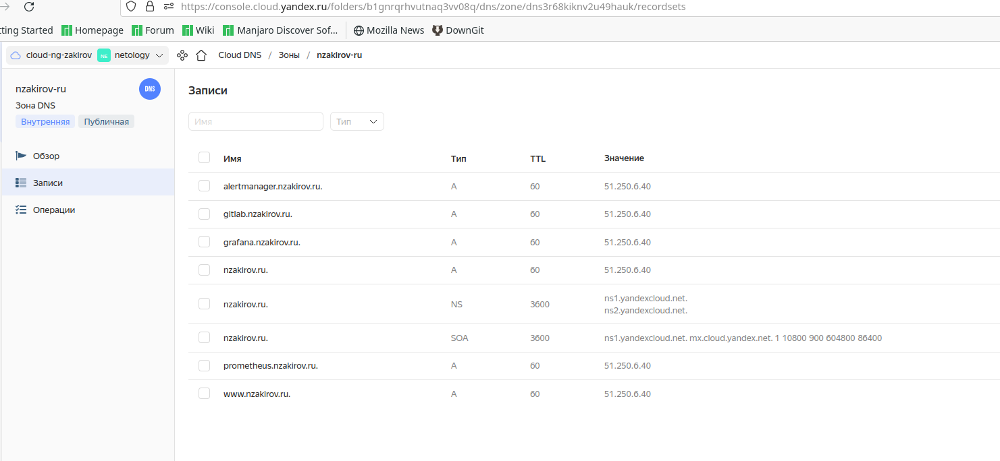


В файле [meta.yml](./src/terraform/stage/meta.yml) с метаданными описываем пользователя с именем virtops, под которым будут проводится все действия по SSH на развертываемой инфраструктуре (в качестве ключей указываем публичные SSH ключи хостов с которых планируется выполнять развертывание):

```yaml
#cloud-config
users:
  - name: virtops
    groups: sudo
    shell: /bin/bash
    sudo: ['ALL=(ALL) NOPASSWD:ALL']
    ssh-authorized-keys:
      - ssh-rsa ..........
      - ssh-rsa .......... 
      - ssh-rsa .......... 
```
Инфраструктура, согласно заданию, распределена на 3 подсети в разных зонах доступности:

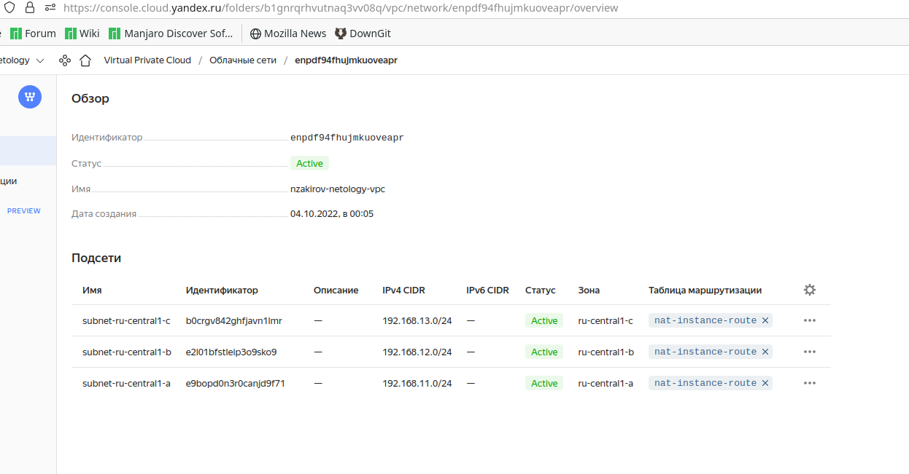

Создано 7 виртуальных машин посредством [terraform кода](./src/terraform/stage/vm.tf), где в качестве proxy использован образ ```nat-instance-ubuntu-18-04-lts-v20220829``` и остальных 6-ти ВМ образ ```ubuntu-20-04-lts-v20220822```


Для минимизации расходов на использование облачных ресурсов, после запуска виртуальных машин, неиспользуемые ВМ (в процессе настройки и написании отчета) останавливаются посредством скрипта [stop_all_instances](./src/stop_all_instances.sh). Обратное действие - запуск осуществляется при помощи скрипта [start_all_instance.sh](./scr/start_all_instance.sh)

В результате развертывания инфраструктура имеет следующий состав:

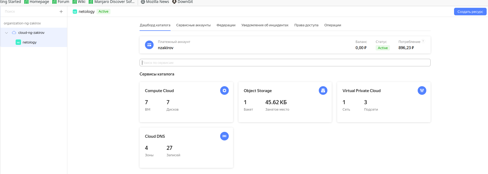

Вывод манифестов terraform, в частности данных о выделенных при развертывании ip адресов, сохраняем в output.json:

```bash 
terraform output -json > output.json
```

Из которого затем экспортируем переменные ip адресов:

```bash
# add variables
export vm_app_private=$(< output.json jq -r '.vm_app_private | .value')
export vm_db01_private=$(< output.json jq -r '.vm_db01_private | .value')
export vm_db02_private=$(< output.json jq -r '.vm_db02_private | .value')
export vm_gitlab_private=$(< output.json jq -r '.vm_gitlab_private | .value')
export vm_monitoring_private=$(< output.json jq -r '.vm_monitoring_private | .value')
export vm_proxy_private=$(< output.json jq -r '.vm_proxy_private | .value')
export vm_runner_private=$(< output.json jq -r '.vm_runner_private | .value')
```
Для дальнейшего развертывания необходимо чтобы доменные имена сервисов проекта были доступны и ресолвились актуальными значениями, для того чтобы избежать времени ожидания, когда записи распространятся по глобальной сети, указываем на локальном хосте в качестве DNS серверов непосредственно сами DNS сервера Yandex:  77.88.8.8 и 77.88.8.1 . Для этого написан bash скрипт [set-dns.sh](./src/set-dns.sh) в котором сохраняются в файл текущие DNS сервера и устанавливаются сервера Yandex. (реализация для Linux дистрибутивов где используется Network Manager). Обратное действие по восстановлению исходных DNS серверов на локальном хосте осуществляется при помощи скрипта [unset-dns.sh](./src/unset-dns.sh)
Проверяем доступность proxy по доменному имени при помощи ping:

```bash
sleep 3
(( count = 10 ))
while [[ $count -ne 0 ]] ; do
    ping -c 1 nzakirov.ru
    ping_result=$?
    if [[ $ping_result -eq 0 ]]
    then
        (( count = 1 ))
    else
        sleep 5
    fi
    (( count-- ))
done

if [[ $ping_result -eq 0 ]]
then
    echo "БЕЗ БУЛДЫРАБЫЗ!!! Host is available"
else
    ../../unset-dns.sh
    exit
fi
```
Для обеспечения удобного и безопасного доступа к хостам, развертываемой облачной инфраструктуры, будем испольовать единую точку входа по ssh - SSH Jump Server, в нашем случае jump host будет хост proxy. Для этого создан фрагмент файла конфигурации ~/.ssh/config в виде текстового [файла](./src/ssh-config.txt), который при помощи скрипта добавляет в системный конфиг данные для подключения к виртуальным машинам развертываемой инфраструктуры.

```bash
cat ../../ssh-config.txt >> ~/.ssh/config
```

На основе шаблона [hosts.template](./src/ansible/hosts.template) формируем hosts файл

```bash
cd ../../ansible || return
envsubst < "hosts.template" > "hosts"
```

На данном этапе все готово для запуска ansible для установки требуемых сервисов на виртуальных машинах развертываемой инфраструктуры.
Запускаем ansible-playbook:

```ansible-playbook playbook.yml -i hosts```


### Установка Nginx и LetsEncrypt

При помощи роли [proxy_server](./src/ansible/roles/proxy_server/) разворачиваем на базе **NGINX reverse proxy**, устанавливаем **LetsEncrypt**  и получаем бесплатные сертификаты

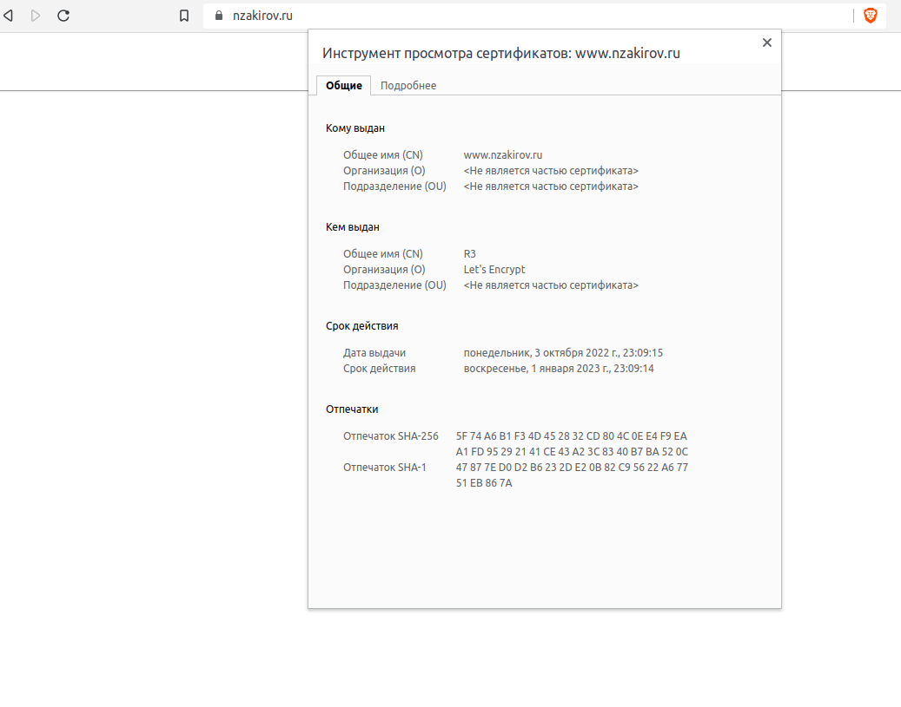

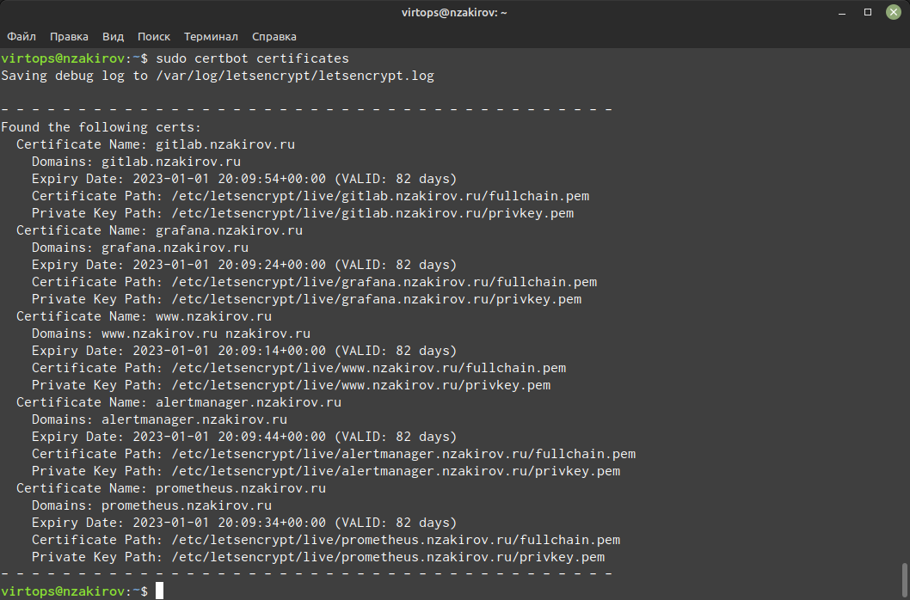

Переменные задаются при помощи механизма шаблонов Jinja2 в файле [./defaults/main.yml](./src/ansible/roles/proxy_server/defaults/main.yml). 

### Установка кластера MySQL

При помощи роли [mysql](./src/ansible/roles/mysql/) устанавливаем и настраиваем кластер **MySQL master-slave replication**.
Переменные задаются при помощи шаблонов  Jinja2 в файле [./defaults/main.yml](./src/ansible/roles/mysql/defaults/main.yml)  

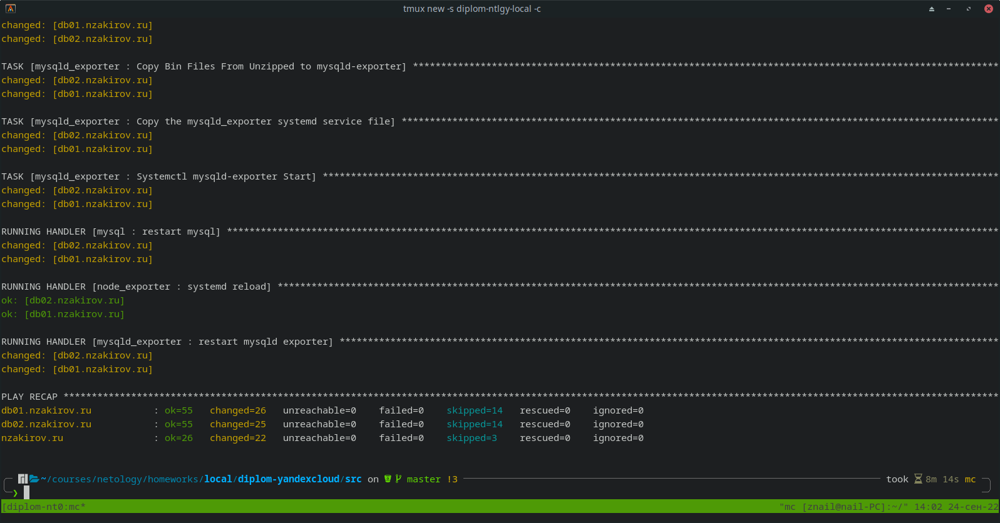

### Установка WordPress

При помощи роли [wordpress](./src/ansible/roles/wordpress/) устанавливаем следующие сервисы:
- **apache2**;
- **php-7.2**;
- **wordpress**

Wordpress подключается к ранее установленному кластеру MySQL.
Переменные задаются при помощи шаблонов  Jinja2 в файле [./defaults/main.yml](./src/ansible/roles/wordpress/defaults/main.yml)  

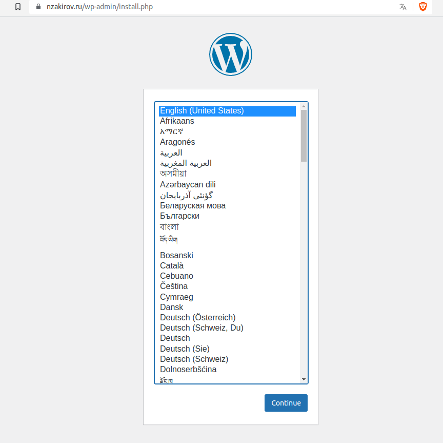

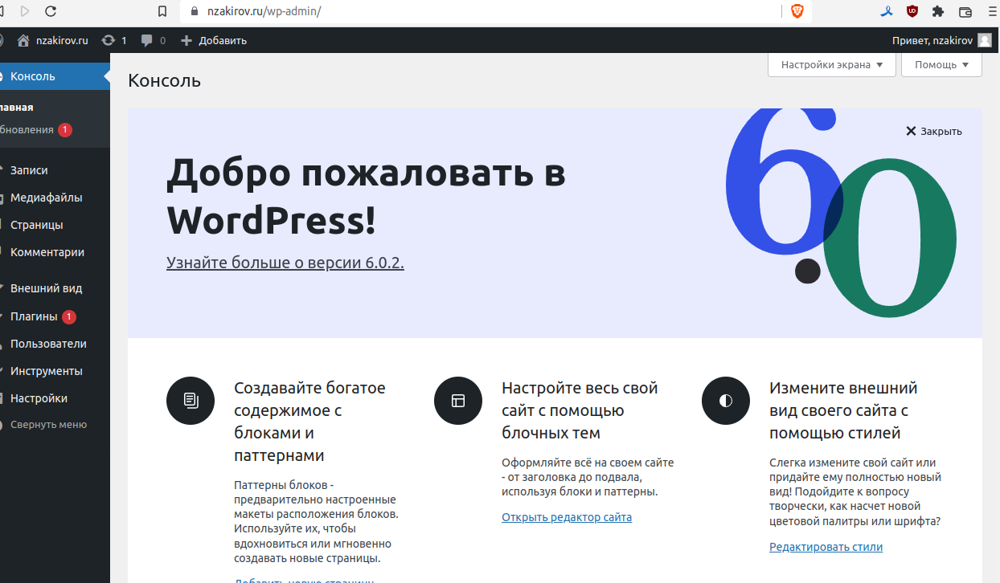

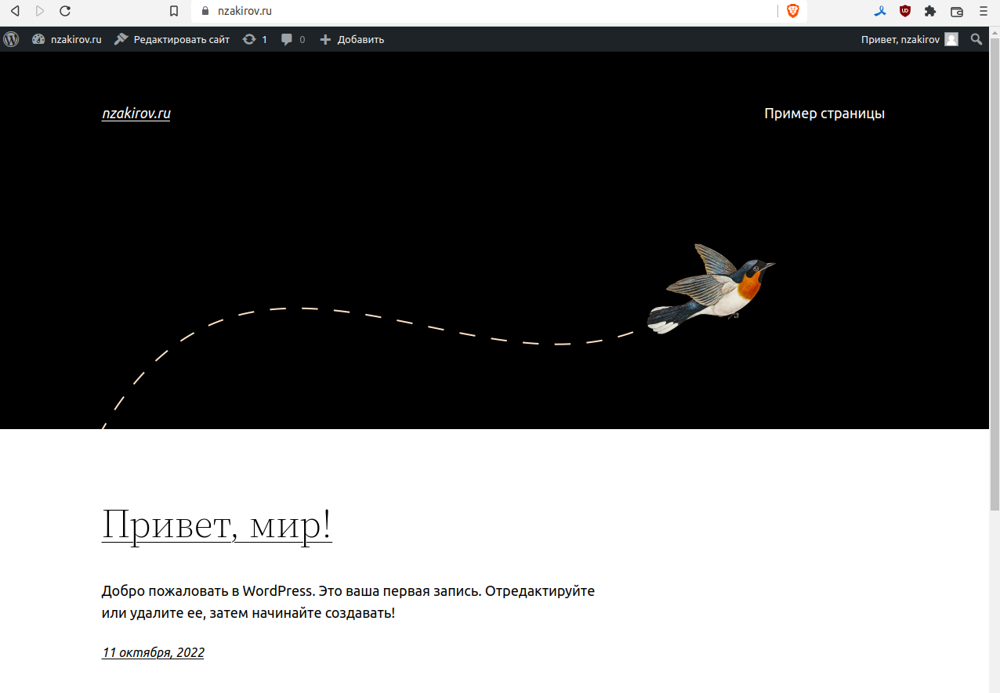


### Установка Gitlab CE, Gitlab Runner и настройка CI/CD

При помощи ролей разворачиваем [gitlab](./src/ansible/roles/gitlab/) (*root/1q2w3e4r*) и [runner](./src/ansible/roles/runner) (*подключается автоматически, runners_registration_token задан в конфигурации*).
Переменные задаются при помощи шаблонов  Jinja2 в файлах: [./defaults/main.yml](./src/ansible/roles/gitlab/defaults/main.yml) и [./defaults/main.yml](./src/ansible/roles/runner/defaults/main.yml) 

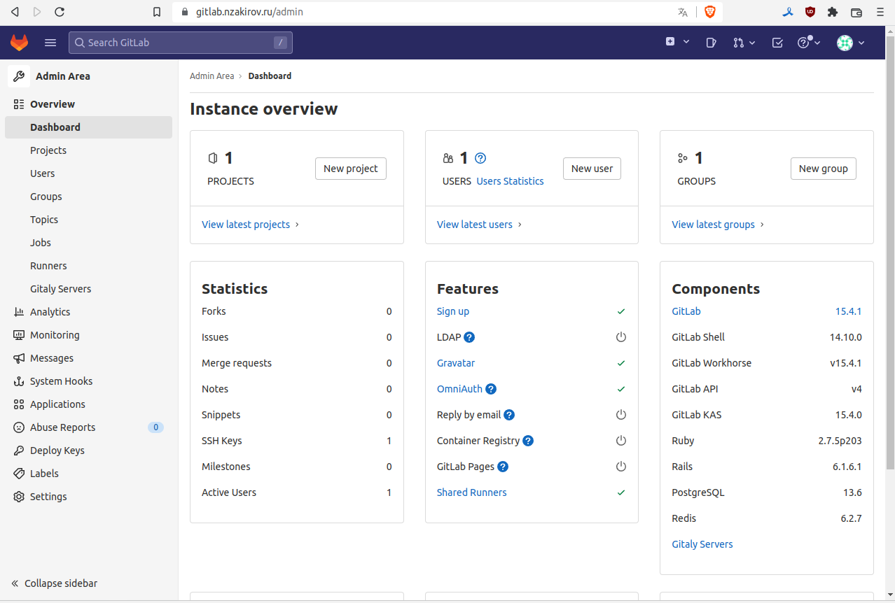

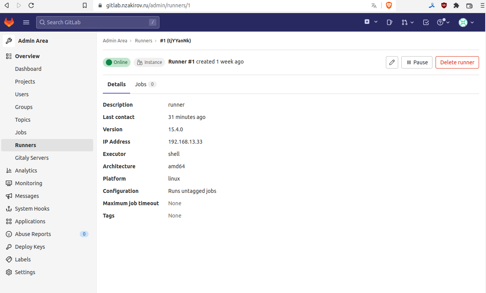

Создаем **.gitlab-ci.yml**

```yaml
---
before_script:
  - 'which ssh-agent || ( apt-get update -y && apt-get install openssh-client -y )'
  - eval $(ssh-agent -s)
  - echo "$ssh_key" | tr -d '\r' | ssh-add -
  - mkdir -p ~/.ssh
  - chmod 700 ~/.ssh

stages:
  - deploy

deploy-job:
  stage: deploy
  script:
    - echo "Deploying application..."
    - ssh -o StrictHostKeyChecking=no virtops@app.nzakirov.ru sudo chown virtops /var/www/www.nzakirov.ru/wordpress/ -R
    - rsync -rvz -e "ssh -o StrictHostKeyChecking=no" ./ virtops@app.nzakirov.ru:/var/www/www.nzakirov.ru/wordpress/
    - ssh -o StrictHostKeyChecking=no virtops@app.nzakirov.ru rm -rf /var/www/www.nzakirov.ru/wordpress/.git
    - ssh -o StrictHostKeyChecking=no virtops@app.nzakirov.ru sudo chown www-data /var/www/www.nzakirov.ru/wordpress/ -R
```
 
 Предварительно добавив **ssh-key** в *Settings/CI/CD/Variables*

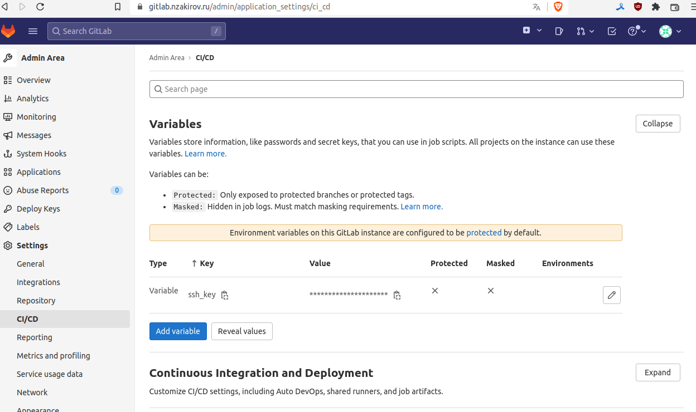

 Для демонстрации работы CI/CD pipeline склонируем созданный на gitlab репозиторий wordpress на локальную машину и добавим для теста файл info.php:

 ```
❯ git clone git@192.168.12.12:gitlab-instance-6a41b4b2/ntlgy-wordpress.git
Клонирование в «ntlgy-wordpress»…
remote: Enumerating objects: 3, done.
remote: Counting objects: 100% (3/3), done.
remote: Compressing objects: 100% (2/2), done.
remote: Total 3 (delta 0), reused 0 (delta 0), pack-reused 0
Получение объектов: 100% (3/3), готово.
❯ cd ntlgy-wordpress
❯ git status
На ветке main
Ваша ветка обновлена в соответствии с «origin/main».

нечего коммитить, нет изменений в рабочем каталоге
❯ git tag -a v1.0 -m "my version 1.0"
❯ git tag
v1.0
❯ lvim info.php

❯ git status
На ветке main
Ваша ветка обновлена в соответствии с «origin/main».

Неотслеживаемые файлы:
  (используйте «git add <файл>…», чтобы добавить в то, что будет включено в коммит)
	info.php

ничего не добавлено в коммит, но есть неотслеживаемые файлы (используйте «git add», чтобы отслеживать их)

❯ git add info.php

❯ git commit -m "Add info.php v1.0"
[main b417881] Add info.php v1.0
 1 file changed, 1 insertion(+)
 create mode 100644 info.php

❯ git push origin v1.0
Перечисление объектов: 1, готово.
Подсчет объектов: 100% (1/1), готово.
Запись объектов: 100% (1/1), 165 байтов | 165.00 КиБ/с, готово.
Всего 1 (изменений 0), повторно использовано 0 (изменений 0), повторно использовано пакетов 0
To 192.168.12.12:gitlab-instance-6a41b4b2/ntlgy-wordpress.git
 * [new tag]         v1.0 -> v1.0

 ```

Результат работы CI/CD pipeline

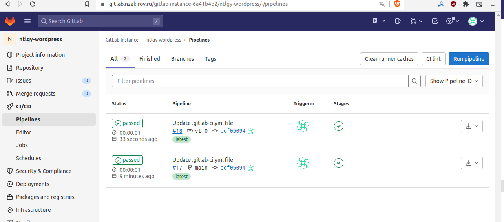

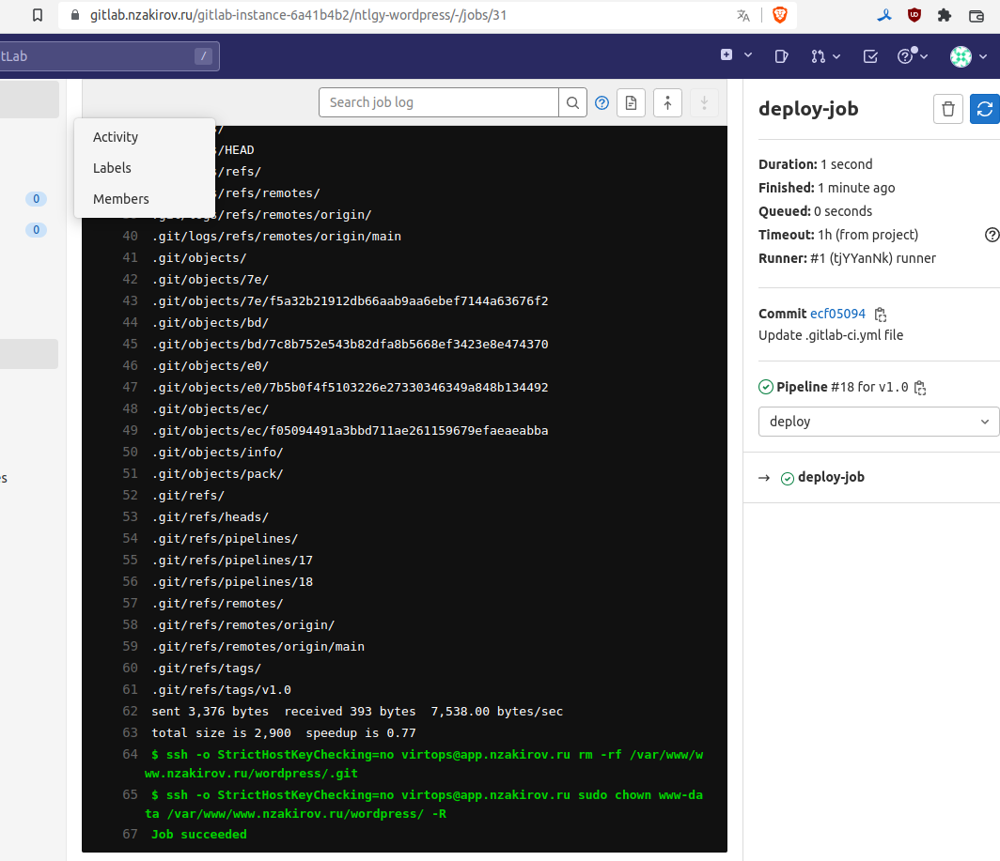

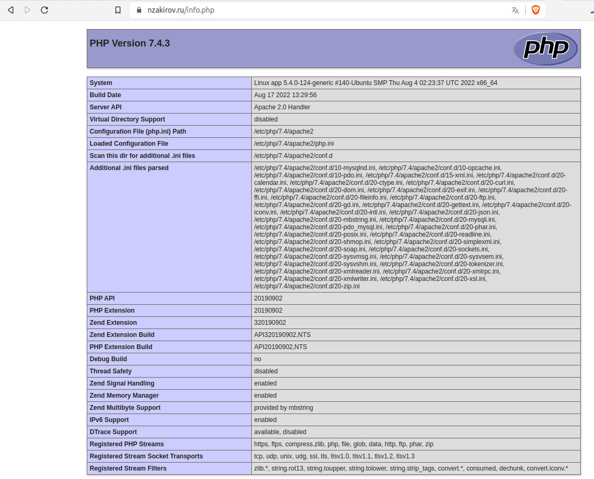


### Установка Prometheus, Alert Manager, Node Exporter и Grafana

При помощи ролей [prometheus](./src/ansible/roles/prometheus/), [grafana](./src/ansible/roles/grafana/) (*admin/admin*), [alertmanager](./src/ansible/roles/alertmanager/) и [node_exporter](./src/ansible/roles/node_exporter/) развертываем стек мониторинга.
Переменные и конфигурации  задаются в файлах [./roles/prometheus/templates/prometheus.yml](./src/ansible/roles/prometheus/templates/prometheus.yml), [./roles/alertmanager/templates/alerts.rules.yml](./src/ansible/roles/alertmanager/templates/alerts.rules.yml)

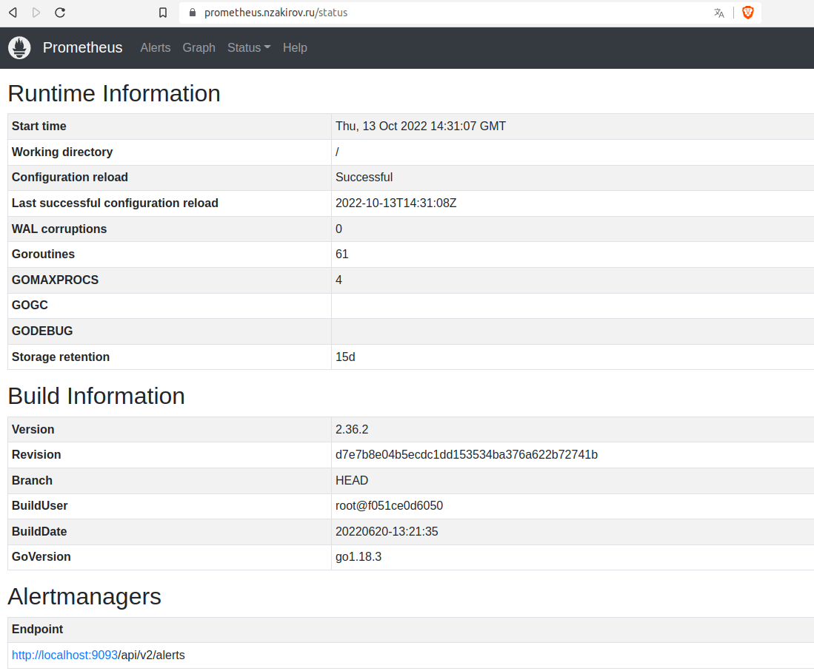

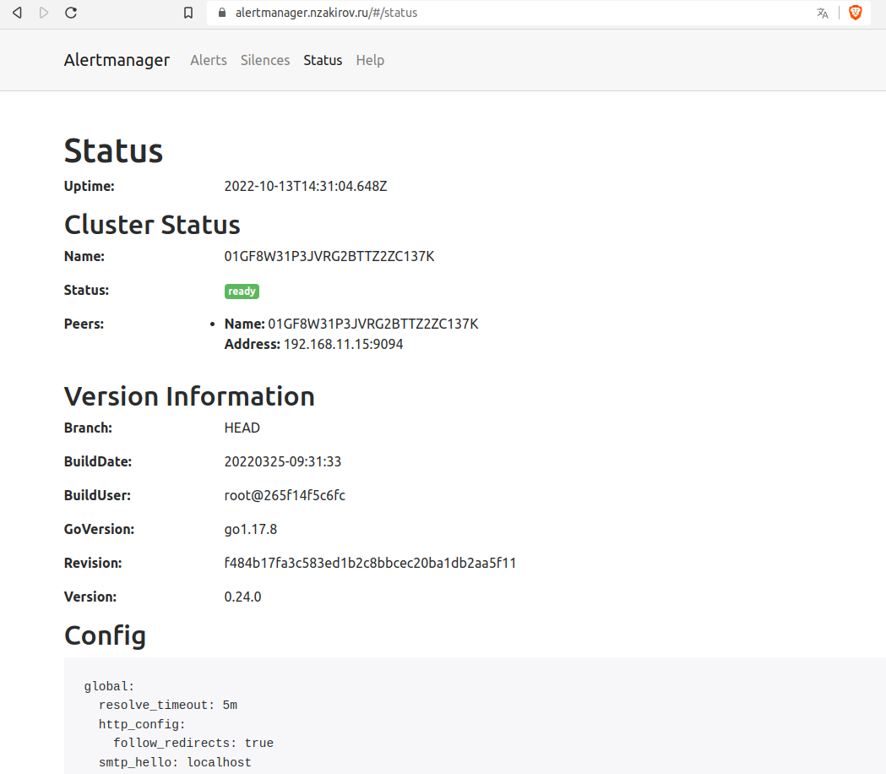

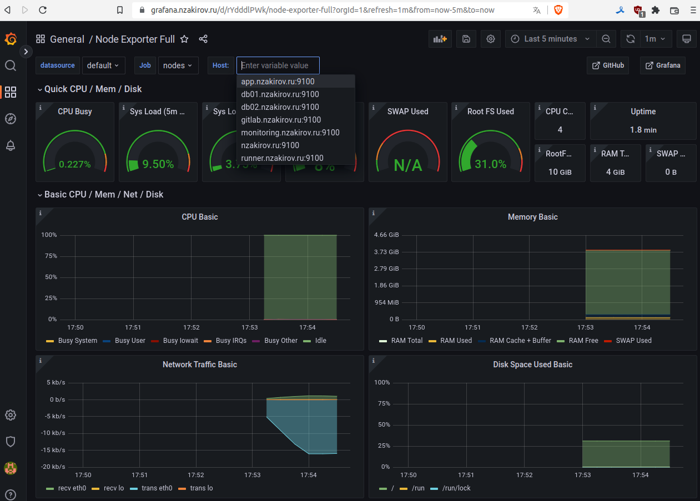

Остановим некоторые из ВМ. Получаем критические уведомления о недоступности:

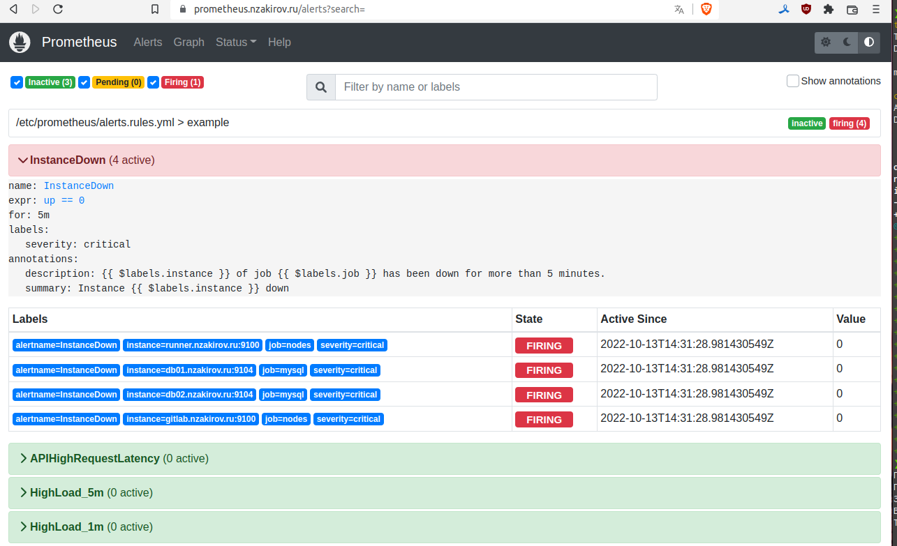
